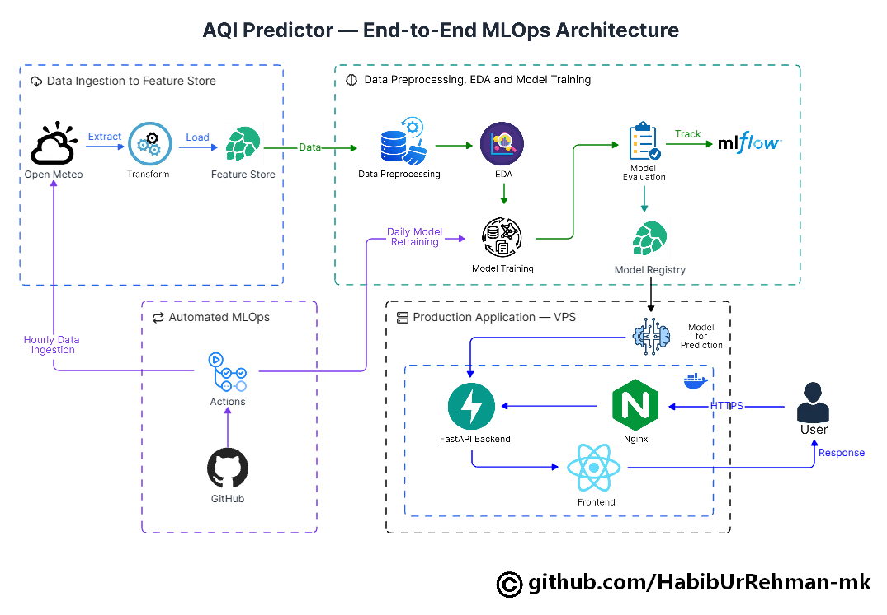
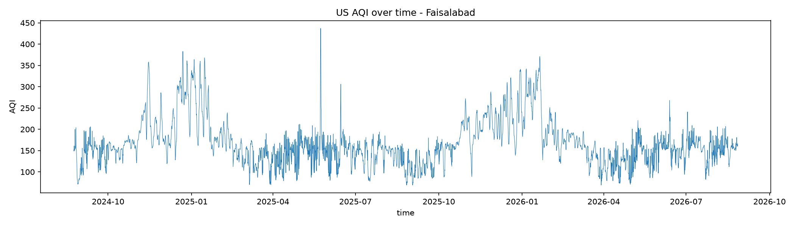
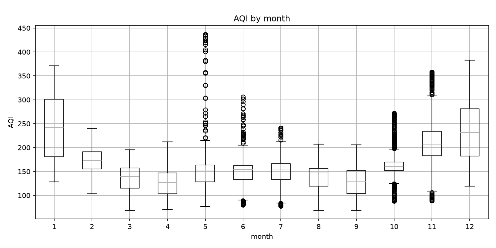
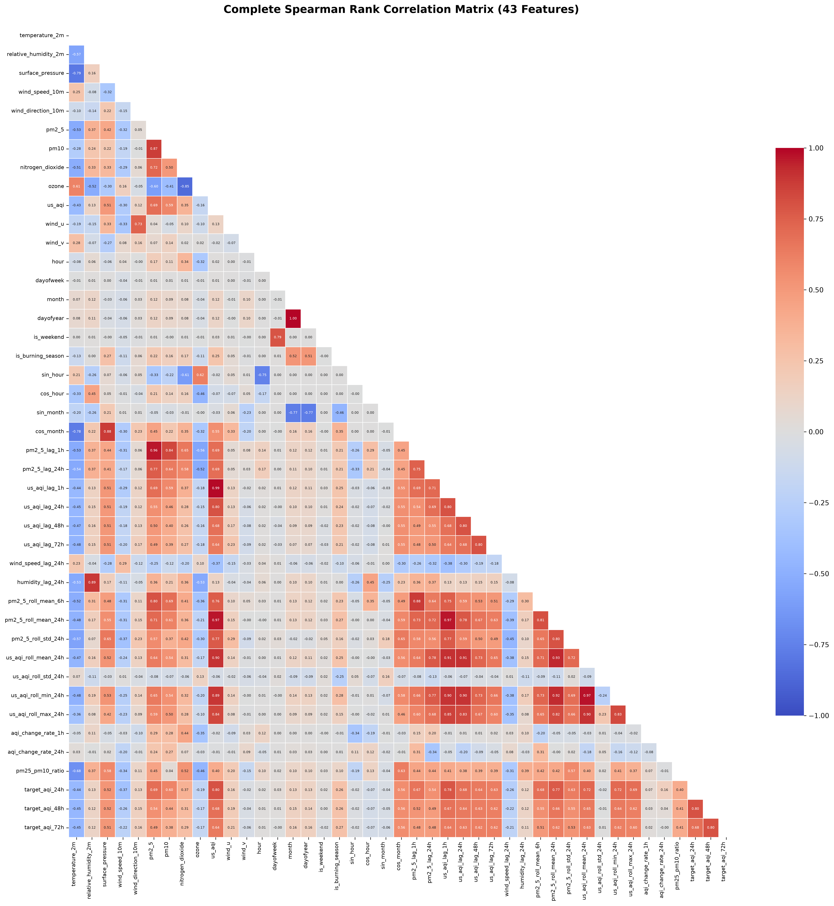
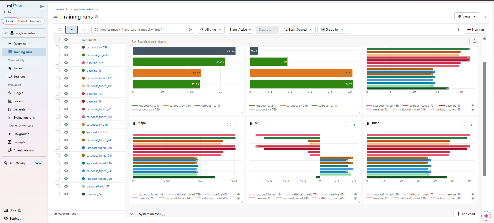

# Faisalabad AQI Predictor

A multi-horizon (**24h / 48h / 72h**) Air Quality Index forecasting system for Faisalabad, Pakistan — built on an hourly Hopsworks feature pipeline, tracked end-to-end in MLflow, and served through a FastAPI + React application behind Nginx.
---
**Live at:** [aqi.habib.systems](https://aqi.habib.systems)
---

  

---

## Table of Contents

- [Overview](#overview)
- [Tech Stack](#tech-stack)
- [Architecture](#architecture)
- [Data Pipeline](#data-pipeline)
- [Exploratory Data Analysis](#exploratory-data-analysis)
- [Feature Engineering](#feature-engineering)
- [Modeling Methodology](#modeling-methodology)
- [Results](#results)
- [Explainability](#explainability)
- [Model Registry](#model-registry)
- [Deployment](#deployment)
- [Local Setup](#local-setup)
- [Environment Variables](#environment-variables)
- [Design Decisions](#design-decisions)
- [Roadmap](#roadmap)
- [License](#license)

---

## Overview

Faisalabad AQI Predictor covers the full lifecycle of an ML product built for a Pakistani city with heavy seasonal pollution (textile-industry emissions plus winter crop-burning):

1. **Ingest** hourly weather and pollutant data from **Open-Meteo** into the **Hopsworks Feature Store**.
2. **Engineer** calendar, cyclical, lag, and rolling-window features, with an explicit leakage gap between train/validation/test.
3. **Compare** eight candidate models per forecast horizon — a persistence baseline, four classical/linear models, three gradient-boosted models — then **tune and cross-validate** the top performer.
4. **Track** every run (baseline, comparison, tuning, cross-validation) in **MLflow**.
5. **Register** the champion model per horizon in the **Hopsworks Model Registry**.
6. **Serve** predictions through a **FastAPI** backend, fronted by **Nginx**, consumed by a **React** dashboard, all running on a **DigitalOcean VPS**.
7. **Automate** the hourly ingestion/feature loop with **GitHub Actions** — no continuously running training server.

> **Data provenance note:** all air-quality and weather data is *modeled* atmospheric data (CAMS global model, via Open-Meteo), not physical ground-station sensor readings.

---

## Tech Stack

| Layer | Technology |
|---|---|
| Language | Python 3.12 |
| Data handling | pandas, NumPy |
| Classical ML | scikit-learn (Linear Regression, Ridge, Decision Tree, Random Forest) |
| Gradient boosting | XGBoost, LightGBM, CatBoost |
| Deep learning (explored) | LSTM — tried during experimentation; did not outperform the gradient-boosted models and was not carried forward into tuning/registry (see [Results](#results)) |
| Feature store / model registry | Hopsworks |
| Experiment tracking | MLflow |
| Backend API | FastAPI |
| Reverse proxy | Nginx |
| Frontend | React |
| Data source | Open-Meteo (Air Quality + Weather APIs, CAMS model) |
| Automation | GitHub Actions |
| Hosting | DigitalOcean VPS |

---

## Architecture

As shown in the diagram above, the system has four stages:

1. **Data ingestion to Feature Store** — Open-Meteo is polled hourly, data is transformed, and loaded into the Hopsworks Feature Store.
2. **Data preprocessing, EDA & model training** — features are cleaned and explored, models are trained and evaluated, every run is tracked in MLflow, and the champion per horizon is pushed to the Hopsworks Model Registry. Daily retraining is triggered automatically.
3. **Automated MLOps** — GitHub Actions drives the hourly ingestion loop, keeping the whole system serverless (no always-on training infrastructure).
4. **Production application (VPS)** — the registered model serves predictions through FastAPI, Nginx handles inbound HTTPS traffic, and the React frontend renders forecasts for the user.

---

## Data Pipeline

| Stage | Detail |
|---|---|
| Source | Open-Meteo Air Quality API (CAMS) + Weather API |
| Feature store | Hopsworks feature group (`weather_aqi_hourly`), read live at training time |
| City | Faisalabad |
| Granularity | Hourly |
| Snapshot size | 17,592 rows × 45 columns |
| Missing targets | 0 dropped (recent rows with no future value are excluded before this snapshot) |
| Duplicate rows | 0 |
| Train window | 2024‑08‑24 → 2026‑04‑02 (14,073 rows) |
| Validation window | 2026‑04‑05 → 2026‑06‑14 (1,687 rows) |
| Test window | 2026‑06‑17 → 2026‑08‑26 (1,688 rows) |
| Leakage gap | 72 rows left after each split boundary, since the longest target looks 72h ahead |

A snapshot is saved to Parquet at data-collection time so results stay comparable across reruns, since the live online feature store keeps growing every hour.

**Leakage prevention:**
- Chronological (never random) 80/10/10 train/validation/test split.
- A 72-row gap enforced after each split boundary — without it, a training row near the boundary could carry a target value that actually falls inside the validation or test period.
- Lag and rolling features use strictly backward-looking windows.

---

## Exploratory Data Analysis

  

AQI in Faisalabad spikes sharply in winter (Nov–Jan), consistent with the city's textile-industry emissions combined with seasonal crop-burning.

  

The by-month boxplot confirms the seasonal pattern: median AQI is highest and most volatile in January, November, and December, with May–July showing a secondary spread driven by outlier pollution events, and the calmest air quality in March–April and August–September.

---

## Feature Engineering

| Category | Features |
|---|---|
| Calendar | hour, day of week, month, day of year, weekend flag |
| Cyclical encoding | sin/cos of hour, sin/cos of month |
| Current weather | temperature, relative humidity, surface pressure, wind speed, wind u/v components |
| Pollutants | PM2.5, PM10, NO₂, ozone, current US AQI, PM2.5/PM10 ratio |
| AQI lags | 1h, 24h, 48h, 72h |
| Rolling statistics | PM2.5 and AQI mean/std at 6h and 24h windows; AQI min/max at 24h |
| Domain flag | `is_burning_season` |
| Targets | AQI at +24h, +48h, +72h (three independent regression targets) |

**Feature selection:** candidate features were ranked per target horizon by Spearman rank correlation (computed on training rows only, to avoid leakage). The full correlation structure across 43 engineered features is below:

  

From this ranking, a final set of **28 features** was selected for modeling — combining the strongest AQI/PM2.5 lag and rolling signals with weather and seasonal context, while dropping redundant highly-collinear columns (e.g. `pm10` correlates 0.87 with `pm2_5`; `dayofyear` correlates 1.00 with `dayofweek`'s seasonal proxy, `cos_month`).

---

## Modeling Methodology

- **Chronological split, never random** — the model is always evaluated on data strictly *after* what it trained on.
- **Persistence baseline first** — every model is compared against "AQI in *n* hours = AQI right now," not just against each other.
- **Model bake-off** — eight candidates compared per horizon under identical conditions: persistence, Linear Regression, Ridge, Decision Tree, Random Forest, XGBoost, LightGBM, CatBoost.
- **LSTM was also explored** as a deep-learning candidate but was dropped from the tuning/registry stage — it did not outperform the gradient-boosted models on this dataset size, and its run metrics weren't retained, so it isn't included in the numeric tables below.
- **Hyperparameter tuning** — the top two candidates (XGBoost, CatBoost) were tuned with `RandomizedSearchCV` (10 iterations, 5-fold CV, scored on RMSE) over grids covering depth, learning rate, subsampling, and regularization.
- **5-fold rolling time-series cross-validation** (`TimeSeriesSplit`, 72-row gap between folds) was run on top of the tuned models, because a single test split can be misleading: the held-out test window (Jun–Aug 2026) happens to have noticeably lower AQI variance (std ≈ 23.0) than the training period (std ≈ 58.1), which inflates single-split R² relative to what the model will see in a "normal" volatility window. The notebook explicitly flags this and recommends trusting the CV mean over the single-split number.
- **Metrics reported:** MAE, RMSE, MAPE, and R² throughout.

---

## Results

### 1. Model bake-off — 24h horizon, single held-out test set

Default/lightly-tuned parameters, no hyperparameter search yet:

| Model | MAE | RMSE | MAPE | R² | Beats baseline |
|---|---|---|---|---|---|
| **CatBoost** | **14.15** | **18.33** | **0.095** | **0.361** | ✅ |
| LightGBM | 14.36 | 18.56 | 0.096 | 0.345 | ✅ |
| XGBoost | 14.75 | 18.89 | 0.098 | 0.322 | ✅ |
| Random Forest | 14.92 | 19.65 | 0.101 | 0.266 | ✅ |
| Linear Regression | 15.58 | 19.81 | 0.103 | 0.254 | ✅ |
| Ridge | 15.58 | 19.81 | 0.103 | 0.254 | ✅ |
| Decision Tree | 16.95 | 22.51 | 0.115 | 0.037 | ✅ |
| Persistence (baseline) | 17.31 | 23.46 | 0.122 | −0.046 | — |

CatBoost led on every metric at 24h even before tuning, which is why it — alongside XGBoost, the runner-up — was carried forward into hyperparameter tuning.

### 2. Tuned models — single held-out test set (vs. baseline, same test window)

| Horizon | Model | MAE | R² | Persistence baseline MAE | Persistence baseline R² |
|---|---|---|---|---|---|
| 24h | CatBoost (tuned) | **14.04** | **0.385** | 17.31 | −0.046 |
| 24h | XGBoost (tuned) | 14.40 | 0.332 | 17.31 | −0.046 |
| 48h | CatBoost (tuned) | **19.50** | −0.119 | 21.78 | −0.656 |
| 72h | CatBoost (tuned) | **19.88** | −0.144 | 21.83 | −0.756 |

Tuned CatBoost beats the persistence baseline at every horizon on this test window — meaningfully at 24h, and by a smaller but still real margin at 48h/72h, where R² stays negative for both the model and the baseline (a genuinely hard regime: 3-day-ahead AQI in a city this volatile is close to the edge of what's predictable from these features alone).

### 3. 5-fold rolling time-series cross-validation (reported metric of record)

Run on the training period only, using `TimeSeriesSplit` with a 72-row gap between folds — this is the more robust, less test-window-dependent estimate, and is what's logged against the registered models in Hopsworks:

| Horizon | Model | CV mean MAE | CV mean R² |
|---|---|---|---|
| 24h | XGBoost | 22.91 | 0.515 |
| 24h | **CatBoost** | **23.30** | **0.514** |
| 48h | **CatBoost** | **31.50** | **0.187** |
| 72h | **CatBoost** | **35.11** | **0.039** |

*(XGBoost was only cross-validated at the 24h horizon in this notebook; CatBoost was the one carried through CV at 48h and 72h, which is why it — not XGBoost — is the registered champion at every horizon, for consistency.)*

  

**Reading the two evaluation numbers together, honestly:** the CV mean MAE (≈23 at 24h, ≈31–35 at 48h/72h) is higher than the single-split test MAE (≈14 at 24h, ≈20 at 48h/72h) precisely because of the variance mismatch noted above — the final test window was an unusually calm few months. The CV numbers are the fairer estimate of what to expect in a typical (including high-pollution winter) period, and R² dropping from ~0.5 at 24h to ~0.19 at 48h and ~0.04 at 72h is the honest picture: the model is clearly useful one day out, only modestly useful two days out, and barely better than a coin-flip-level baseline three days out. That degradation with horizon is expected and is called out directly rather than hidden.

---

## Explainability

CatBoost's built-in feature importances for the 24h model, highest to lowest:

| Rank | Feature | Importance |
|---|---|---|
| 1 | `pm2_5_roll_mean_24h` | 8.85 |
| 2 | `cos_month` (seasonality) | 8.57 |
| 3 | `pm10` | 7.95 |
| 4 | `us_aqi` (current reading) | 7.33 |
| 5 | `pm2_5` | 6.74 |
| 6 | `us_aqi_lag_48h` | 5.49 |
| 7 | `wind_speed_10m` | 5.06 |
| 8 | `us_aqi_lag_72h` | 4.73 |
| 9 | `us_aqi_lag_1h` | 4.27 |
| 10 | `surface_pressure` | 3.58 |

The current AQI reading, its recent lags, 24h-rolling PM2.5, and calendar seasonality (`cos_month`) dominate — consistent with AQI being strongly autocorrelated and driven by the winter burning season.

---

## Model Registry

| Resource | Detail |
|---|---|
| Registry | Hopsworks Model Registry |
| Models registered | `aqi_predictor_24h`, `aqi_predictor_48h`, `aqi_predictor_72h` |
| Model type | CatBoost (tuned), one independent model per horizon |
| Logged metrics | CV mean MAE / CV mean R² (see [Results](#results)) |
| Artifacts | `model.pkl` + input/output schema, uploaded per horizon |

Each model is registered with its own input/output schema and description (e.g. *"24 hour ahead AQI prediction model"*), so the serving layer can validate inputs before calling `.predict()`.

---

## Deployment

- **Backend:** FastAPI, serving predictions from the latest registered Hopsworks model per horizon.
- **Reverse proxy:** Nginx, terminating HTTPS and routing to the FastAPI backend and React frontend.
- **Frontend:** React dashboard consuming the FastAPI endpoints.
- **Host:** a single DigitalOcean VPS running the production application stack.
- **Automation:** GitHub Actions drives the hourly data-ingestion loop into the Hopsworks Feature Store and the scheduled retraining, keeping the pipeline serverless — no dedicated always-on training machine.

---

## Local Setup
Coming

## Environment Variables

| Variable | Required for | Notes |
|---|---|---|
| `HOPSWORKS_API_KEY` | Feature Store / Model Registry | Never commit — set via `.env` locally, repo secrets in CI |
| `HOPSWORKS_HOST` | Feature Store / Model Registry | e.g. `eu-west.cloud.hopsworks.ai` |
| `HOPSWORKS_PROJECT` | Feature Store / Model Registry | Your Hopsworks project name |
| `MLFLOW_TRACKING_URI` | Experiment tracking | Local (`mlruns/`) or a remote MLflow server |

---

## Design Decisions

- **Persistence baseline as the floor, not the ceiling** — every model, including the eventual champion, is judged against "no model at all" first. This keeps the reported gains honest rather than only comparing models against each other.
- **Per-horizon champion, not one model for all three** — 24h, 48h, and 72h are treated as genuinely different problems with independently tuned/validated models, matching how the difficulty (and achievable R²) clearly changes with horizon.
- **CV mean over single-split metrics** — the notebook explicitly detects a variance mismatch between the training and test windows and reports the 5-fold rolling CV mean as the metric of record, rather than the more flattering single-split number.
- **GitHub Actions over a dedicated scheduler** — matches the serverless requirement of the project without provisioning always-on infrastructure for hourly ingestion.
- **Hopsworks for both feature store and model registry** — a single platform for point-in-time-correct feature serving and versioned model artifacts, avoiding a custom-built store.
- **LSTM explored, not shipped** — tried during experimentation but did not beat the gradient-boosted models on this dataset, so the project standardized on CatBoost rather than carrying a more complex, harder-to-explain model forward for a marginal (or no) gain.

---

## Roadmap

- Re-run the LSTM experiment with proper metric logging, to get a fair, MLflow-tracked comparison against CatBoost.
- Improve 48h/72h performance specifically — current R² (0.19 / 0.04) is the clearest weak point in the system.
- Extend cross-validation to XGBoost at the 48h/72h horizons for a like-for-like comparison with CatBoost.
- Add production monitoring and drift detection on the deployed FastAPI service.
- Expand beyond a single city (Faisalabad) using the same Hopsworks-backed pipeline.

---

## License

Internal capstone/internship project. License terms to be confirmed with the project owner before external reuse.
