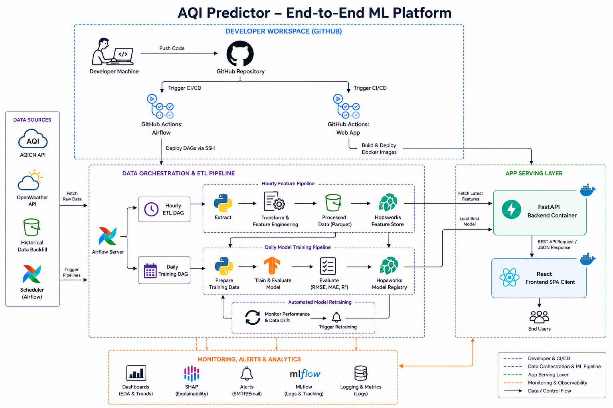

# AQI Predictor – End-to-End Machine Learning Platform

<p align="center">
  
</p>

<p align="center">
  <strong>Predict the Air Quality Index (AQI) for the next 3 days using a fully automated Machine Learning pipeline.</strong>
</p>

<p align="center">
  Automated Data Collection • Feature Engineering • Feature Store • Model Registry • Auto Retraining • FastAPI • React • CI/CD
</p>

---

# Overview

AQI Predictor is an end-to-end Machine Learning system that forecasts the **Air Quality Index (AQI)** for the next **3 days** using historical weather and pollution data.

The platform continuously collects real-time air quality data from external APIs, transforms it into ML-ready features, stores them inside **Hopsworks Feature Store**, automatically retrains models on a schedule, and serves predictions through a **FastAPI backend** and **React dashboard**.

The complete workflow is fully automated using **Apache Airflow**, while deployment is handled through **GitHub Actions CI/CD**.

---

# ✨ Features

- 🌤 Automatic AQI & weather data collection
- ⚙️ Automated ETL & Feature Engineering pipeline
- 🧠 Feature Store powered by Hopsworks
- 🤖 Daily model training and evaluation
- 🔄 Automatic model retraining
- 📦 Model Registry using Hopsworks
- 🚀 FastAPI prediction service
- 💻 Interactive React dashboard
- 📊 SHAP Explainability
- 📈 Exploratory Data Analysis
- 🔔 AQI Alert System
- 🔁 Complete CI/CD using GitHub Actions

---

# 🏗 System Architecture

The project consists of four major layers.

## 1. Developer Workspace

Developers work locally and push code to GitHub.

GitHub Actions automatically detects changes and deploys:

- Apache Airflow DAGs
- Backend services
- Frontend application

This removes manual deployment and keeps every environment synchronized.

---

## 2. Data Orchestration & ML Pipeline

Apache Airflow orchestrates the complete ML workflow.

### Hourly ETL Pipeline

The feature pipeline runs every hour and performs:

1. Fetch AQI & Weather data
2. Extract raw records
3. Clean and preprocess data
4. Perform Feature Engineering
5. Store engineered features inside **Hopsworks Feature Store**

Features include:

- Hour
- Day
- Month
- AQI lag values
- Moving averages
- Weather statistics
- AQI change rate
- Rolling window features

---

### Daily Training Pipeline

Every day Airflow automatically executes the training pipeline.

The pipeline performs:

- Load historical features
- Prepare training dataset
- Train multiple ML models
- Evaluate model performance
- Compare metrics
- Register the best model

Supported models include:

- Random Forest
- Ridge Regression
- TensorFlow Neural Networks

Evaluation metrics:

- RMSE
- MAE
- R² Score

The best performing model is automatically stored inside the **Hopsworks Model Registry**.

---

### Automatic Model Retraining

The platform continuously improves itself.

When new data becomes available:

- Airflow triggers retraining
- Updated features are loaded
- Models are trained again
- Performance is evaluated
- The best version replaces the previous production model inside the Model Registry

This ensures predictions remain accurate without manual intervention.

---

## 3. Prediction Service

The production backend is built using **FastAPI**.

For every prediction request, FastAPI:

1. Loads the latest production model from Hopsworks Model Registry
2. Retrieves the latest online features from Hopsworks Feature Store
3. Generates AQI forecasts
4. Returns predictions through REST APIs

The backend is fully containerized for deployment.

---

## 4. Frontend Dashboard

The React web application communicates with FastAPI to display:

- Current AQI
- 3-Day AQI Forecast
- Historical trends
- Model predictions
- AQI categories
- Hazard alerts
- Feature importance visualizations

---

# ⚙️ CI/CD Pipeline

The entire deployment process is automated.

```
Developer
      │
      ▼
GitHub Repository
      │
      ▼
GitHub Actions
      ├──────────────► Deploy Airflow DAGs
      ├──────────────► Build Backend
      └──────────────► Deploy React Frontend
```

Every push automatically triggers:

- Build
- Test
- Deployment

No manual deployment is required.

---

# 🔄 End-to-End Workflow

```
External APIs
      │
      ▼
Apache Airflow
      │
      ▼
ETL Pipeline
      │
      ▼
Feature Engineering
      │
      ▼
Hopsworks Feature Store
      │
      ▼
Daily Model Training
      │
      ▼
Model Evaluation
      │
      ▼
Hopsworks Model Registry
      │
      ▼
FastAPI Backend
      │
      ▼
React Dashboard
      │
      ▼
Users
```

---

# 🛠 Technology Stack

| Category | Technologies |
|-----------|--------------|
| Programming | Python |
| Machine Learning | Scikit-learn, TensorFlow |
| Feature Store | Hopsworks |
| Model Registry | Hopsworks |
| Workflow Orchestration | Apache Airflow |
| Backend | FastAPI |
| Frontend | React |
| Data Source | AQICN API, OpenWeather API |
| Explainability | SHAP |
| Version Control | Git |
| CI/CD | GitHub Actions |
| Containerization | Docker |

---

# 📁 Project Structure

```
.
├── airflow/
├── backend/
├── frontend/
├── feature_pipeline/
├── training_pipeline/
├── models/
├── notebooks/
├── diagrams/
│   └── architecture_diagram.png
├── .github/
│   └── workflows/
├── requirements.txt
├── docker-compose.yml
└── README.md
```

---

# 🚀 Future Improvements

- Multi-city forecasting
- Model drift detection
- Online learning
- Real-time streaming ingestion
- Multiple forecasting models
- Ensemble prediction
- User authentication
- Mobile application
- Kubernetes deployment
- Cloud-native monitoring

---

# 👨‍💻 Authors

Built as an end-to-end MLOps project demonstrating automated Machine Learning pipelines, Feature Stores, Model Registries, CI/CD, and modern production deployment practices.